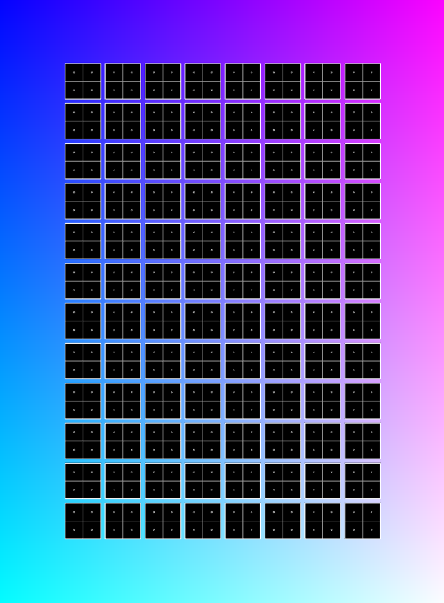

## CS CityScope JS

Application in js that allows users to examine different urban-design alternatives and observe their impact through different KPIs and matrices.

### Instructions

Websockets, python code + instructions

## Blocks App

Application in Processing that simulates the physical table

## MovingLegosServer App

Application in openFrameworks that simulates the physical table
